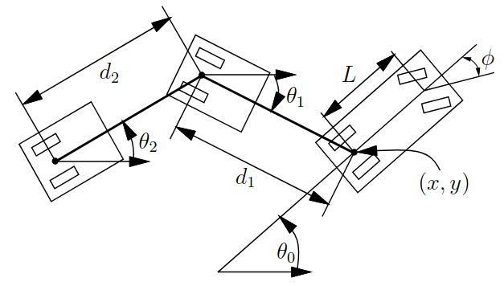

::: {.content-visible unless-format="pdf"}

:::

# Car With Trailer

## Dynamics

- Parameters
    - $L$: distance between the wheels [m]
    - $d_1$: distance between car and trailer [m]
    - state space $\sX$
    - action space $\sU$
- State: $\vx = \begin{pmatrix}x, y, \theta_0, \theta_1 \end{pmatrix}^\top \in \sX$
    - position $(x, y)^\top$ [m]
    - orientation of the car $\theta_0$ [rad]
    - relative orientation of the trailer $\theta_1$ [rad]
- Action: $\vu = \begin{pmatrix} v, \phi \end{pmatrix}^\top \in \sU$
    - speed $v$ [m/s]
    - front wheel angle $\phi$ [rad]
- Dynamics: 
    $$
    \begin{aligned}
        \dot x &= v \cos \theta_0\\
        \dot y &= v \sin \theta_0\\
        \dot \theta_0 &= \frac{v}{L} \tan \phi\\
        \dot \theta_1 &= \frac{v}{d_1} \sin{(\theta_0 - \theta_1)}
    \end{aligned}
    $$

::: {.callout-note}
This is generalized in @lavallePlanningAlgorithms2006 [Eq. (13.19)] to more than 1 trailer.
:::

## Differential Flatness

## Invariance

The dynamics are translation-invariant.

## Controllers

## Useful Parameters

### car1_with_1trailer_v0
<!-- https://github.com/quimortiz/dynobench/blob/main/models/car1_v0.yaml -->

A basic version proposed at (@hoenig2022dbAstar; @2024-ortiz-haro-IDbAIterativeSearch)
$$
\begin{aligned}
L &= 0.25 m\\
d_1 &= 0.5 m\\
\sU &= [-0.1, 0.5] m/s \times [-\pi/3, \pi/3] rad\\
\pi/4 &> | \angle (\theta_0, \theta_1) |
\end{aligned}
$$

::: {.callout-note}
The last constraint limits the state space $\sX$.
:::

