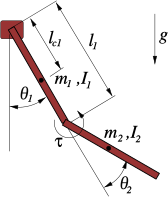

---
format:
  html:
    code-fold: true
jupyter: python3
---

::: {.content-visible unless-format="pdf"}

:::

# Acrobot



## Dynamics

- Parameters
    - $\sX$: state space 
    - $\sU$: action space
    - $l_1$: length of first link [m]
    - $m_1$: mass of first link [kg]
    - $I_1$: inertia of first link [kg m^2]
    - $l_{c1}$: length to first pivot point [m]
    - $l_2$: length of second link [m]
    - $m_2$: mass of second link [kg]
    - $I_2$: inertia of second link [kg m^2]
    - $l_{c2}$: length to second pivot point [m]
    - $g$: gravity constant [m/s^2]

- State: $\vx = \begin{pmatrix}\theta_1, \theta_2, \dot \theta_1, \dot \theta_2 \end{pmatrix}^\top \in \sX \subset \mathbb R^4$ 
    - joint angles $(\theta_1, \theta_2)^\top$ [rad]
    - angular velocity $(\dot \theta_1, \dot \theta_2)^\top$ [rad/s]
- Action: $\vu = (\tau) \in \sU$ 
    - Torque $\tau$ [Nm]
-   Dynamics: 

    In standard manipulator equation form:
    $$
    \mM (\ddot \theta_1, \ddot \theta_2)^\top + \mC (\dot \theta_1, \dot \theta_2)^\top = \tau_g + \mB \vu
    $$

    ```{python}
    #| echo: false
    #| output: asis

    import sympy as sp
    import numpy as np

    # load our custom module
    import sys
    from pathlib import Path
    module_path = str(Path.cwd() / ".." / "code")
    if module_path not in sys.path:
        sys.path.append(module_path)
    from sympy_helper import *

    # parameters
    l1 = sp.Symbol("l1")
    m1 = sp.Symbol("m1")
    I1 = sp.Symbol("I1")
    lc1 = sp.Symbol("lc1")
    l2 = sp.Symbol("l2")
    m2 = sp.Symbol("m2")
    I2 = sp.Symbol("I2")
    lc2 = sp.Symbol("lc2")
    g = sp.Symbol("g")

    # action
    tau = sp.Symbol("tau")

    # states
    theta1 = sp.Symbol("theta1")
    theta2 = sp.Symbol("theta2")
    dtheta1 = sp.Symbol("dtheta1")
    dtheta2 = sp.Symbol("dtheta2")

    ## result
    ddtheta1 = sp.Symbol("ddtheta1")
    ddtheta2 = sp.Symbol("ddtheta2")

    latex_symbol_names={l1: r'l_1', m1: r'm_1', I1: r'I_1', lc1: r'l_{c1}', l2: r'l_2', m2: r'm_2', I2: r'I_2', lc2: r'l_{c2}', tau: r'\tau', theta1: r"\theta_1", theta2: r"\theta_2", dtheta1: r"\dot\theta_1", dtheta2: r"\dot\theta_2", ddtheta1: r"\ddot\theta_1", ddtheta2: r"\ddot\theta_2"}

    printer = MyLatexPrinter(l1, latex_symbol_names)

    #lc1 = l1/2
    #lc2 = l2/2

    q = sp.Matrix([theta1, theta2])
    dq = sp.Matrix([dtheta1, dtheta2])

    M = sp.Matrix([[I1+I2+m2*l1*l1+2*m2*l1*lc2*sp.cos(theta2), I2+m2*l1*lc2*sp.cos(theta2)],
                [I2+m2*l1*lc2*sp.cos(theta2), I2]])

    C = sp.Matrix([[-2*m2*l1*lc2*sp.sin(theta2)*dtheta2, -m2*l1*lc2*sp.sin(theta2)*dtheta2],
                [m2*l1*lc2*sp.sin(theta2)*dtheta1, 0]])

    tau_g = sp.Matrix([-m1*g*lc1*sp.sin(theta1)-m2*g*(l1*sp.sin(theta1)+lc2*sp.sin(theta1+theta2)),
                    -m2*g*lc2*sp.sin(theta1+theta2)])

    B = sp.Matrix([0, 1])

    u = sp.Matrix([tau])

    printer.showEqArray([
        (r"\mM", M),
        (r"\mC", C),
        (r"\tau_g", tau_g),
        (r"\mB", B)
    ])

    #M_inv = sp.inv_quick(M)

    #ddq = sp.simplify(M_inv @ (tau_g + B@u - C@dq))

    #printer.show(ddq)
    ```

    Explicit expressions for $\ddot \theta_1, \ddot \theta_2$ are:

    ```{python}
    #| echo: false
    #| output: asis

    M_inv = sp.inv_quick(M)
    ddq = sp.simplify(M_inv @ (tau_g + B@u - C@dq))

    replacements, reduced_expr = sp.cse(ddq)
    all = replacements + [(ddtheta1, reduced_expr[0][0]), (ddtheta2, reduced_expr[0][1])]
    printer.showAllSubs(all)
    ```

## Differential Flatness

## Invariance

## Controllers

### Geometric Controller

### Action Mixing

## Useful Parameters

### acrobot_v0
<!-- https://github.com/quimortiz/dynobench/blob/main/models/acrobot_v0.yaml -->

A basic version based on [@2024-underactuated-robotics] proposed at (@2024-ortiz-haro-IDbAIterativeSearch)
$$
\begin{aligned}
l_1 &= 1\\
m_1 &= 1\\
I_1 &= 0.33333\\
l_{c1} &= 0.5\\
l_2 &= 1\\
m_2 &= 1\\
I_2 &= 0.33333\\
l_{c2} &= 0.5\\
g &= 9.81\\
\dot \theta_1 &\in [-8, 8]\\
\dot \theta_2 &\in [-8, 8]\\
\sU &\in [-10, 10]
\end{aligned}
$$
