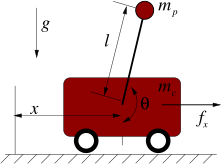

---
format:
  html:
    code-fold: true
jupyter: python3
---

::: {.content-visible unless-format="pdf"}

:::

# Cartpole



Derivation from [here](https://underactuated.csail.mit.edu/acrobot.html#cart_pole).

## Dynamics

-   Parameters
    - $\sX$: state space
    - $\sU$: action space
    - $l$: length of pendulum [m] 
    - $m_c$: mass of cart [kg]
    - $m_p$: mass of pendulum [kg]
    - $g$: gravity constant [m/s^2]

-   State: $\vx = \begin{pmatrix} x, \theta, \dot x, \dot \theta \end{pmatrix}^\top \in \sX \subset \mathbb R \times SO(2) \times \mathbb R^2$ 
    - position $x$ [m]
    - counter-clockwise angle of the pendulum (0=straight down) $\theta$ [rad]
    - velocity $\dot x$ [m/s]
    - angular velocity $\dot \theta$ [rad/s]
-   Action: $\vu = (f_x) \in \sU$ 
    - force $f_x$ [N] 
-   Dynamics: 

    In standard manipulator equation form:

    ```{python}
    #| echo: false
    #| output: asis

    import sympy as sp
    import numpy as np

    # load our custom module
    import sys
    from pathlib import Path
    module_path = str(Path.cwd() / ".." / "code")
    if module_path not in sys.path:
        sys.path.append(module_path)
    from sympy_helper import *

    # parameters
    l = sp.Symbol("l")
    m_c = sp.Symbol("m_c")
    m_p = sp.Symbol("m_p")
    g = sp.Symbol("g")

    # states
    x = sp.Symbol("x")
    theta = sp.Symbol("theta")
    dx = sp.Symbol("dx")
    dtheta = sp.Symbol("dtheta")

    # results
    ddx = sp.Symbol("ddx")
    ddtheta = sp.Symbol("ddtheta")

    # controls
    f_x = sp.Symbol(r"f_x")

    latex_symbol_names={theta: r'\theta', dx: r"\dot x", dtheta: r"\dot \theta", ddx: r"\ddot x", ddtheta: r"\ddot \theta"}

    printer = MyLatexPrinter(l, latex_symbol_names)

    q = sp.Matrix([x, theta])
    dq = sp.Matrix([dx, dtheta])

    M = sp.Matrix([[m_c+m_p, m_p * l * sp.cos(theta)],
                [m_p * l * sp.cos(theta), m_p * l * l]])

    C = sp.Matrix([[0, - m_p * l * dtheta * sp.sin(theta)],
                [0, 0]])

    tau_g = sp.Matrix([0,
                    -m_p * g * l * sp.sin(theta)])

    B = sp.Matrix([1, 0])

    u = sp.Matrix([f_x])

    printer.showEqArray([
        (r"\mM", M),
        (r"\mC", C),
        (r"\tau_g", tau_g),
        (r"\mB", B)
    ])

    #M_inv = sp.inv_quick(M)

    #ddq = sp.simplify(M_inv @ (tau_g + B@u - C@dq))

    #printer.show(ddq)
    ```

    Explicit expressions for $\ddot x, \ddot \theta$ are:

    ```{python}
    #| echo: false 
    #| output: asis 

    M_inv = sp.inv_quick(M)
    ddq = sp.simplify(M_inv @ (tau_g + B@u - C@dq))
 
    #h1 = sp.Symbol("h_1")
    #r1 = ddq.subs(l1 * lc2 * m2, h1)

    # printer.showEq(r"(\ddot x, \ddot \theta)^\top", ddq)
    replacements, reduced_expr = sp.cse(ddq)
    all = replacements + [(ddx, reduced_expr[0][0]), (ddtheta, reduced_expr[0][1])]

    printer.showAllSubs(all)
    # printer.showAllCode(reduced_expr)
    ```

## Differential Flatness

## Invariance

## Controllers

### Geometric Controller

### Action Mixing

## Useful Parameters

### cartpole_v0

```{python}
#| echo: false
#| output: asis
params = [(l, 1), (m_c, 1), (m_p, 1), (g, 10)]
printer.showSubs(params)
cartpole_v0 = sp.simplify(ddq.subs(params))
replacements, reduced_expr = sp.cse(cartpole_v0)
all = replacements + [(ddx, reduced_expr[0][0]), (ddtheta, reduced_expr[0][1])]
printer.showAllSubs(all)
```


