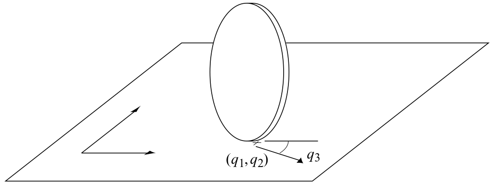

::: {.content-visible unless-format="pdf"}

:::

# Unicycle

## Dynamics

- Parameters
    - state space $\sX$
    - action space $\sU$
- State: $\vx = \begin{pmatrix}x, y, \theta, v, \omega\end{pmatrix}^\top \in \sX \subset SE(2) \times R^2$ 
    - Position $(x,y)^\top$ [m, global frame]
    - Orientation $\theta$ [rad, global frame]
    - Velocity $v$ [m/s, global frame]
    - Angular velocity $\omega$ [rad/s, body frame]
- Action: $\vu = \begin{pmatrix} a_v, a_\omega \end{pmatrix}^\top \in \sU$ 
    - Acceleration $a_v$ [m/s^2, global frame]
    - Angular acceleration $a_\omega$ [rad/s^2, global frame]
- Dynamics: 
    $$
    \begin{aligned}
        \dot x &= v \cos \theta \\
        \dot y &= v \sin \theta \\
        \dot \theta &= \omega\\
        \dot v &= a_v\\
        \dot \omega &= a_\omega
    \end{aligned}
    $$

## Differential Flatness

## Invariance

The dynamics are translation-invariant.

## Controllers

### Geometric Controller

### Action Mixing

## Useful Parameters

### unicycle2_v0
<!-- https://github.com/quimortiz/dynobench/blob/main/models/unicycle2_v0.yaml -->

A basic version proposed at (@hoenig2022dbAstar; @2024-ortiz-haro-IDbAIterativeSearch)
$$
\begin{aligned}
\sX &= \mathbb R^2 \times [-\pi, \pi] \times [-0.5, 0.5] \times [-0.5, 0.5]\\
\sU &= [-0.25, 0.25] \times [-0.25, 0.25]
\end{aligned}
$$
